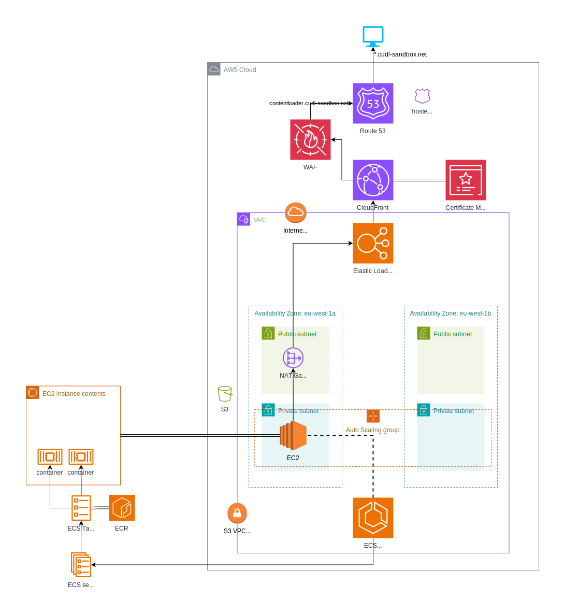

# Terraform Module for ECS Architecture

This Terraform module builds the base AWS infrastructure needed to support ECS Services. This module implements the architecture described below .

The module will by default build an Auto Scaling Group in private subnets. VPC Endpoints create links to AWS services that will allow the ECS Services to run, as well as accessing ECR repositories.

By default the `ec2_keypair` input is null, and no Security Group rules allow for SSH access. EC2 instances can be accessed using AWS Session Manager. 

In order to provide a running ECS Service, a child module will need to build it's own ECS Service and ECS Task Definition objects, in addition to an ECR Repository. It will not be possible to use publicly available container images as instances in private subnets will have no outbound route to the internet.

A child module will also need to create its own Load Balancer Listener and Load Balancer Target Group. The child module will need an `aws_autoscaling_attachment` resource to connect the target group to the Autoscaling Group created by this module. The attachment allows the Autoscaling Group to automatically register EC2 Instances with the target group.

To allow connectivity from the Internet, this module has been designed to operate through AWS CloudFront. This has not been implemented in this module as several CloudFront distributions may exist for the same ECS base architecture. The output `alb_dns_name` from this module can be used in the `domain_name` and `origin_id` arguments of a custom `origin` block in a `aws_cloudfront_distribution` resource in Terraform: this will direct requests from the CloudFront distribution to the public Application Load Balancer created by this module. This module also outputs a value `waf_acl_arn` that may be passed into the `web_acl_id` argument of a `aws_cloudfront_distribution` resource to protect the CloudFront distribution.

## Requirements

No requirements.

## Providers

| Name | Version |
|------|---------|
| <a name="provider_aws"></a> [aws](#provider\_aws) | 5.50.0 |
| <a name="provider_aws.us-east-1"></a> [aws.us-east-1](#provider\_aws.us-east-1) | 5.50.0 |

## Modules

No modules.

## Resources

| Name | Type |
|------|------|
| [aws_acm_certificate.default](https://registry.terraform.io/providers/hashicorp/aws/latest/docs/resources/acm_certificate) | resource |
| [aws_acm_certificate_validation.default](https://registry.terraform.io/providers/hashicorp/aws/latest/docs/resources/acm_certificate_validation) | resource |
| [aws_autoscaling_group.this](https://registry.terraform.io/providers/hashicorp/aws/latest/docs/resources/autoscaling_group) | resource |
| [aws_default_security_group.this](https://registry.terraform.io/providers/hashicorp/aws/latest/docs/resources/default_security_group) | resource |
| [aws_ecs_capacity_provider.this](https://registry.terraform.io/providers/hashicorp/aws/latest/docs/resources/ecs_capacity_provider) | resource |
| [aws_ecs_cluster.this](https://registry.terraform.io/providers/hashicorp/aws/latest/docs/resources/ecs_cluster) | resource |
| [aws_ecs_cluster_capacity_providers.this](https://registry.terraform.io/providers/hashicorp/aws/latest/docs/resources/ecs_cluster_capacity_providers) | resource |
| [aws_eip.nat_a](https://registry.terraform.io/providers/hashicorp/aws/latest/docs/resources/eip) | resource |
| [aws_eip.nat_b](https://registry.terraform.io/providers/hashicorp/aws/latest/docs/resources/eip) | resource |
| [aws_iam_instance_profile.instance](https://registry.terraform.io/providers/hashicorp/aws/latest/docs/resources/iam_instance_profile) | resource |
| [aws_iam_role.instance](https://registry.terraform.io/providers/hashicorp/aws/latest/docs/resources/iam_role) | resource |
| [aws_iam_role_policy_attachment.ec2_container_service](https://registry.terraform.io/providers/hashicorp/aws/latest/docs/resources/iam_role_policy_attachment) | resource |
| [aws_iam_role_policy_attachment.ssm_managed_instance](https://registry.terraform.io/providers/hashicorp/aws/latest/docs/resources/iam_role_policy_attachment) | resource |
| [aws_internet_gateway.this](https://registry.terraform.io/providers/hashicorp/aws/latest/docs/resources/internet_gateway) | resource |
| [aws_launch_template.this](https://registry.terraform.io/providers/hashicorp/aws/latest/docs/resources/launch_template) | resource |
| [aws_lb.this](https://registry.terraform.io/providers/hashicorp/aws/latest/docs/resources/lb) | resource |
| [aws_lb_listener.https](https://registry.terraform.io/providers/hashicorp/aws/latest/docs/resources/lb_listener) | resource |
| [aws_nat_gateway.nat_a](https://registry.terraform.io/providers/hashicorp/aws/latest/docs/resources/nat_gateway) | resource |
| [aws_nat_gateway.nat_b](https://registry.terraform.io/providers/hashicorp/aws/latest/docs/resources/nat_gateway) | resource |
| [aws_route.cudl_vpc_ec2_route_igw](https://registry.terraform.io/providers/hashicorp/aws/latest/docs/resources/route) | resource |
| [aws_route53_record.acm_validation_cname](https://registry.terraform.io/providers/hashicorp/aws/latest/docs/resources/route53_record) | resource |
| [aws_route53_zone.public](https://registry.terraform.io/providers/hashicorp/aws/latest/docs/resources/route53_zone) | resource |
| [aws_route_table.main](https://registry.terraform.io/providers/hashicorp/aws/latest/docs/resources/route_table) | resource |
| [aws_route_table.private_a](https://registry.terraform.io/providers/hashicorp/aws/latest/docs/resources/route_table) | resource |
| [aws_route_table.private_b](https://registry.terraform.io/providers/hashicorp/aws/latest/docs/resources/route_table) | resource |
| [aws_route_table.public](https://registry.terraform.io/providers/hashicorp/aws/latest/docs/resources/route_table) | resource |
| [aws_route_table_association.private_a](https://registry.terraform.io/providers/hashicorp/aws/latest/docs/resources/route_table_association) | resource |
| [aws_route_table_association.private_b](https://registry.terraform.io/providers/hashicorp/aws/latest/docs/resources/route_table_association) | resource |
| [aws_route_table_association.public_a](https://registry.terraform.io/providers/hashicorp/aws/latest/docs/resources/route_table_association) | resource |
| [aws_route_table_association.public_b](https://registry.terraform.io/providers/hashicorp/aws/latest/docs/resources/route_table_association) | resource |
| [aws_s3_bucket.this](https://registry.terraform.io/providers/hashicorp/aws/latest/docs/resources/s3_bucket) | resource |
| [aws_s3_bucket_versioning.this](https://registry.terraform.io/providers/hashicorp/aws/latest/docs/resources/s3_bucket_versioning) | resource |
| [aws_security_group.alb](https://registry.terraform.io/providers/hashicorp/aws/latest/docs/resources/security_group) | resource |
| [aws_security_group.asg](https://registry.terraform.io/providers/hashicorp/aws/latest/docs/resources/security_group) | resource |
| [aws_security_group.vpc_endpoints](https://registry.terraform.io/providers/hashicorp/aws/latest/docs/resources/security_group) | resource |
| [aws_security_group_rule.alb_ingress_cloudfront](https://registry.terraform.io/providers/hashicorp/aws/latest/docs/resources/security_group_rule) | resource |
| [aws_security_group_rule.asg_egress_all](https://registry.terraform.io/providers/hashicorp/aws/latest/docs/resources/security_group_rule) | resource |
| [aws_security_group_rule.vpc_endpoint_egress_self](https://registry.terraform.io/providers/hashicorp/aws/latest/docs/resources/security_group_rule) | resource |
| [aws_security_group_rule.vpc_endpoint_ingress_self](https://registry.terraform.io/providers/hashicorp/aws/latest/docs/resources/security_group_rule) | resource |
| [aws_security_group_rule.vpc_endpoints_egress_s3](https://registry.terraform.io/providers/hashicorp/aws/latest/docs/resources/security_group_rule) | resource |
| [aws_subnet.private_a](https://registry.terraform.io/providers/hashicorp/aws/latest/docs/resources/subnet) | resource |
| [aws_subnet.private_b](https://registry.terraform.io/providers/hashicorp/aws/latest/docs/resources/subnet) | resource |
| [aws_subnet.public_a](https://registry.terraform.io/providers/hashicorp/aws/latest/docs/resources/subnet) | resource |
| [aws_subnet.public_b](https://registry.terraform.io/providers/hashicorp/aws/latest/docs/resources/subnet) | resource |
| [aws_vpc.this](https://registry.terraform.io/providers/hashicorp/aws/latest/docs/resources/vpc) | resource |
| [aws_vpc_dhcp_options.this](https://registry.terraform.io/providers/hashicorp/aws/latest/docs/resources/vpc_dhcp_options) | resource |
| [aws_vpc_dhcp_options_association.this](https://registry.terraform.io/providers/hashicorp/aws/latest/docs/resources/vpc_dhcp_options_association) | resource |
| [aws_vpc_endpoint.interface](https://registry.terraform.io/providers/hashicorp/aws/latest/docs/resources/vpc_endpoint) | resource |
| [aws_vpc_endpoint.s3](https://registry.terraform.io/providers/hashicorp/aws/latest/docs/resources/vpc_endpoint) | resource |
| [aws_vpc_peering_connection.this](https://registry.terraform.io/providers/hashicorp/aws/latest/docs/resources/vpc_peering_connection) | resource |
| [aws_wafv2_ip_set.this](https://registry.terraform.io/providers/hashicorp/aws/latest/docs/resources/wafv2_ip_set) | resource |
| [aws_wafv2_web_acl.this](https://registry.terraform.io/providers/hashicorp/aws/latest/docs/resources/wafv2_web_acl) | resource |
| [aws_ami.ecs_ami](https://registry.terraform.io/providers/hashicorp/aws/latest/docs/data-sources/ami) | data source |
| [aws_caller_identity.current](https://registry.terraform.io/providers/hashicorp/aws/latest/docs/data-sources/caller_identity) | data source |
| [aws_cloudwatch_log_group.this](https://registry.terraform.io/providers/hashicorp/aws/latest/docs/data-sources/cloudwatch_log_group) | data source |
| [aws_ec2_managed_prefix_list.cloudfront](https://registry.terraform.io/providers/hashicorp/aws/latest/docs/data-sources/ec2_managed_prefix_list) | data source |
| [aws_ec2_managed_prefix_list.s3](https://registry.terraform.io/providers/hashicorp/aws/latest/docs/data-sources/ec2_managed_prefix_list) | data source |
| [aws_iam_policy_document.assume_role_policy](https://registry.terraform.io/providers/hashicorp/aws/latest/docs/data-sources/iam_policy_document) | data source |
| [aws_kms_alias.ebs](https://registry.terraform.io/providers/hashicorp/aws/latest/docs/data-sources/kms_alias) | data source |
| [aws_region.current](https://registry.terraform.io/providers/hashicorp/aws/latest/docs/data-sources/region) | data source |
| [aws_route53_zone.existing](https://registry.terraform.io/providers/hashicorp/aws/latest/docs/data-sources/route53_zone) | data source |

## Inputs

| Name | Description | Type | Default | Required |
|------|-------------|------|---------|:--------:|
| <a name="input_acm_certificate_arn"></a> [acm\_certificate\_arn](#input\_acm\_certificate\_arn) | ARN of an existing certificate in Amazon Certificate Manager | `string` | `null` | no |
| <a name="input_acm_create_certificate"></a> [acm\_create\_certificate](#input\_acm\_create\_certificate) | Whether to create a certificate in Amazon Certificate Manager | `bool` | `true` | no |
| <a name="input_alb_access_logs_bucket"></a> [alb\_access\_logs\_bucket](#input\_alb\_access\_logs\_bucket) | Name of the S3 Bucket for ALB access logs | `string` | `""` | no |
| <a name="input_alb_access_logs_enabled"></a> [alb\_access\_logs\_enabled](#input\_alb\_access\_logs\_enabled) | Whether to enable access logging for the ALB | `bool` | `false` | no |
| <a name="input_alb_access_logs_prefix"></a> [alb\_access\_logs\_prefix](#input\_alb\_access\_logs\_prefix) | Prefix for objects in S3 bucket for ALB access logs | `string` | `""` | no |
| <a name="input_alb_enable_deletion_protection"></a> [alb\_enable\_deletion\_protection](#input\_alb\_enable\_deletion\_protection) | Whether to enable deletion protection for the ALB | `bool` | `true` | no |
| <a name="input_alb_idle_timeout"></a> [alb\_idle\_timeout](#input\_alb\_idle\_timeout) | Idle timeout for load balancer | `string` | `"60"` | no |
| <a name="input_alb_internal"></a> [alb\_internal](#input\_alb\_internal) | Whether the ALB should be internal (not public facing) | `bool` | `false` | no |
| <a name="input_alb_listener_fixed_response_content_type"></a> [alb\_listener\_fixed\_response\_content\_type](#input\_alb\_listener\_fixed\_response\_content\_type) | Default content type for the fixed response of the default ALB Listener | `string` | `"text/html"` | no |
| <a name="input_alb_listener_fixed_response_message_body"></a> [alb\_listener\_fixed\_response\_message\_body](#input\_alb\_listener\_fixed\_response\_message\_body) | Default message body for the fixed response of the default ALB Listener | `string` | `"<!DOCTYPE html><body><h1>Hello World!</h1></body>"` | no |
| <a name="input_alb_listener_fixed_response_status_code"></a> [alb\_listener\_fixed\_response\_status\_code](#input\_alb\_listener\_fixed\_response\_status\_code) | Default status code for the fixed response of the default ALB Listener | `string` | `"200"` | no |
| <a name="input_alb_listener_ssl_policy"></a> [alb\_listener\_ssl\_policy](#input\_alb\_listener\_ssl\_policy) | TLS security policy used by the default ALB Listener | `string` | `"ELBSecurityPolicy-TLS13-1-2-2021-06"` | no |
| <a name="input_ami_architecture"></a> [ami\_architecture](#input\_ami\_architecture) | Name of the OS Architecture. Note must be compatible with the selected EC2 Instance Type | `string` | `"x86_64"` | no |
| <a name="input_ami_name_prefix"></a> [ami\_name\_prefix](#input\_ami\_name\_prefix) | Prefix used to find an AMI for use in the Launch Template | `string` | `"amzn2-ami-ecs-hvm-2.0*"` | no |
| <a name="input_asg_allow_all_egress"></a> [asg\_allow\_all\_egress](#input\_asg\_allow\_all\_egress) | Whether to allow EC2 instances in ASG egress to all targets | `bool` | `false` | no |
| <a name="input_asg_default_cooldown"></a> [asg\_default\_cooldown](#input\_asg\_default\_cooldown) | Number of seconds between scaling activities | `number` | `300` | no |
| <a name="input_asg_desired_capacity"></a> [asg\_desired\_capacity](#input\_asg\_desired\_capacity) | Desired number of instances in the Autoscaling Group | `number` | `1` | no |
| <a name="input_asg_enabled_metrics"></a> [asg\_enabled\_metrics](#input\_asg\_enabled\_metrics) | List of metrics enabled for the Auotscaling Group | `list(string)` | <pre>[<br>  "GroupTotalInstances",<br>  "GroupInServiceInstances",<br>  "GroupTerminatingInstances",<br>  "GroupPendingInstances",<br>  "GroupInServiceCapacity",<br>  "GroupPendingCapacity",<br>  "GroupTotalCapacity",<br>  "GroupTerminatingCapacity"<br>]</pre> | no |
| <a name="input_asg_health_check_grace_period"></a> [asg\_health\_check\_grace\_period](#input\_asg\_health\_check\_grace\_period) | Grace Period before health checks are enabled. ECS Services can take 10 minutes to stabilise | `number` | `600` | no |
| <a name="input_asg_health_check_type"></a> [asg\_health\_check\_type](#input\_asg\_health\_check\_type) | Type of health check for the Autoscaling Group. Can be EC2 or ELB | `string` | `"EC2"` | no |
| <a name="input_asg_max_size"></a> [asg\_max\_size](#input\_asg\_max\_size) | Maximum number of instances in the Autoscaling Group | `number` | `1` | no |
| <a name="input_asg_metrics_granularity"></a> [asg\_metrics\_granularity](#input\_asg\_metrics\_granularity) | Granularity of metrics collected by the Autoscaling Group | `string` | `"1Minute"` | no |
| <a name="input_asg_min_size"></a> [asg\_min\_size](#input\_asg\_min\_size) | Minimum number of instances in the Autoscaling Group | `number` | `1` | no |
| <a name="input_asg_protect_from_scale_in"></a> [asg\_protect\_from\_scale\_in](#input\_asg\_protect\_from\_scale\_in) | Whether newly launched instances are automatically protected from termination | `bool` | `true` | no |
| <a name="input_asg_termination_policies"></a> [asg\_termination\_policies](#input\_asg\_termination\_policies) | Termination Policies used by the Autoscaling Group | `list(string)` | <pre>[<br>  "OldestLaunchTemplate"<br>]</pre> | no |
| <a name="input_cloudwatch_log_group"></a> [cloudwatch\_log\_group](#input\_cloudwatch\_log\_group) | Name of the cloudwatch log group | `string` | n/a | yes |
| <a name="input_ec2_ebs_volume_type"></a> [ec2\_ebs\_volume\_type](#input\_ec2\_ebs\_volume\_type) | Volume type used in EBS volumes | `string` | `"gp3"` | no |
| <a name="input_ec2_instance_type"></a> [ec2\_instance\_type](#input\_ec2\_instance\_type) | EC2 Instance type used by EC2 Instances | `string` | `"t3.small"` | no |
| <a name="input_ec2_keypair"></a> [ec2\_keypair](#input\_ec2\_keypair) | Name of EC2 Keypair for SSH access to EC2 instances | `string` | `null` | no |
| <a name="input_ecs_capacity_provider_managed_termination_protection"></a> [ecs\_capacity\_provider\_managed\_termination\_protection](#input\_ecs\_capacity\_provider\_managed\_termination\_protection) | Enables or disables container-aware termination of instances in the ASG when scale-in happens | `string` | `"ENABLED"` | no |
| <a name="input_ecs_capacity_provider_status"></a> [ecs\_capacity\_provider\_status](#input\_ecs\_capacity\_provider\_status) | Enables or disables managed scaling on ASG | `string` | `"ENABLED"` | no |
| <a name="input_ecs_capacity_provider_target_capacity_percent"></a> [ecs\_capacity\_provider\_target\_capacity\_percent](#input\_ecs\_capacity\_provider\_target\_capacity\_percent) | Percentage target capacity utilization for the autscaling group instances | `number` | `100` | no |
| <a name="input_ecs_cluster_setting_container_insights"></a> [ecs\_cluster\_setting\_container\_insights](#input\_ecs\_cluster\_setting\_container\_insights) | Whether to enable container insights on the cluster. Valid values enabled, disabled | `string` | `"disabled"` | no |
| <a name="input_name_prefix"></a> [name\_prefix](#input\_name\_prefix) | Name prefix of the ECS Cluster and associated resources | `string` | n/a | yes |
| <a name="input_route53_delegation_set_id"></a> [route53\_delegation\_set\_id](#input\_route53\_delegation\_set\_id) | The ID of the reusable delegation set whose NS records should be assigned to the hosted zone | `string` | `null` | no |
| <a name="input_route53_zone_domain_name"></a> [route53\_zone\_domain\_name](#input\_route53\_zone\_domain\_name) | Name of the Domain Name used by the Route 53 Zone. Trailing dots are ignored | `string` | `null` | no |
| <a name="input_route53_zone_force_destroy"></a> [route53\_zone\_force\_destroy](#input\_route53\_zone\_force\_destroy) | Whether to destroy the Route 53 Zone although records may still exist | `bool` | `false` | no |
| <a name="input_route53_zone_id_existing"></a> [route53\_zone\_id\_existing](#input\_route53\_zone\_id\_existing) | ID of an existing Route 53 Hosted zone as an alternative to creating a hosted zone | `string` | `null` | no |
| <a name="input_s3_bucket_force_destroy"></a> [s3\_bucket\_force\_destroy](#input\_s3\_bucket\_force\_destroy) | Whether to allow a non-empty bucket to be destroyed | `bool` | `false` | no |
| <a name="input_s3_bucket_versioning_enabled"></a> [s3\_bucket\_versioning\_enabled](#input\_s3\_bucket\_versioning\_enabled) | Whether to enable S3 bucket versioning | `bool` | `true` | no |
| <a name="input_tags"></a> [tags](#input\_tags) | Map of tags for adding to resources | `map(string)` | `{}` | no |
| <a name="input_vpc_cidr_block"></a> [vpc\_cidr\_block](#input\_vpc\_cidr\_block) | CIDR block for the VPC | `string` | `"10.0.0.0/16"` | no |
| <a name="input_vpc_endpoint_dns_record_ip_type"></a> [vpc\_endpoint\_dns\_record\_ip\_type](#input\_vpc\_endpoint\_dns\_record\_ip\_type) | The DNS records created for the endpoint | `string` | `"ipv4"` | no |
| <a name="input_vpc_endpoint_services"></a> [vpc\_endpoint\_services](#input\_vpc\_endpoint\_services) | List of services to create VPC Endpoints for | `list(string)` | <pre>[<br>  "ssmmessages",<br>  "ssm",<br>  "ec2messages",<br>  "ecr.api",<br>  "ecr.dkr",<br>  "ecs",<br>  "ecs-agent",<br>  "ecs-telemetry",<br>  "logs"<br>]</pre> | no |
| <a name="input_vpc_peering_vpc_ids"></a> [vpc\_peering\_vpc\_ids](#input\_vpc\_peering\_vpc\_ids) | List of VPC IDS for peering with the VPC | `list(string)` | `[]` | no |
| <a name="input_vpc_public_subnet_public_ip"></a> [vpc\_public\_subnet\_public\_ip](#input\_vpc\_public\_subnet\_public\_ip) | Whether to automatically assign public IP addresses in the public subnets | `bool` | `false` | no |
| <a name="input_waf_ip_set_addresses"></a> [waf\_ip\_set\_addresses](#input\_waf\_ip\_set\_addresses) | List of IPs for WAF IP Set Safelist | `list(string)` | <pre>[<br>  "131.111.0.0/16"<br>]</pre> | no |
| <a name="input_waf_use_ip_restrictions"></a> [waf\_use\_ip\_restrictions](#input\_waf\_use\_ip\_restrictions) | Whether to use IP range restrictions on the default WAF | `bool` | `false` | no |

## Outputs

| Name | Description |
|------|-------------|
| <a name="output_alb_arn"></a> [alb\_arn](#output\_alb\_arn) | ARN of the Application Load Balancer |
| <a name="output_alb_dns_name"></a> [alb\_dns\_name](#output\_alb\_dns\_name) | DNS Name of the Application Load Balancer |
| <a name="output_alb_https_listener_arn"></a> [alb\_https\_listener\_arn](#output\_alb\_https\_listener\_arn) | ARN of the default Application Load Balancer Listener on port 443 |
| <a name="output_alb_security_group_id"></a> [alb\_security\_group\_id](#output\_alb\_security\_group\_id) | ID of the Security Group for the Application Load Balancer |
| <a name="output_asg_name"></a> [asg\_name](#output\_asg\_name) | Name of the Auto Scaling Group |
| <a name="output_asg_security_group_id"></a> [asg\_security\_group\_id](#output\_asg\_security\_group\_id) | ID of the Security Group for the Auto Scaling Group |
| <a name="output_cloudwatch_log_group_arn"></a> [cloudwatch\_log\_group\_arn](#output\_cloudwatch\_log\_group\_arn) | ARN of the CloudWatch Log Group |
| <a name="output_cloudwatch_log_group_name"></a> [cloudwatch\_log\_group\_name](#output\_cloudwatch\_log\_group\_name) | Name of the CloudWatch Log Group |
| <a name="output_ecs_capacity_provider_name"></a> [ecs\_capacity\_provider\_name](#output\_ecs\_capacity\_provider\_name) | Name of the ECS Capacity Provider associated with the Autoscaling Group |
| <a name="output_ecs_cluster_arn"></a> [ecs\_cluster\_arn](#output\_ecs\_cluster\_arn) | ARN of the ECS Cluster |
| <a name="output_ecs_cluster_name"></a> [ecs\_cluster\_name](#output\_ecs\_cluster\_name) | Name of the ECS Cluster |
| <a name="output_route53_public_hosted_zone"></a> [route53\_public\_hosted\_zone](#output\_route53\_public\_hosted\_zone) | Zone ID of the Route 53 Public Hosted Zone |
| <a name="output_s3_bucket"></a> [s3\_bucket](#output\_s3\_bucket) | Name of the S3 Bucket |
| <a name="output_s3_bucket_arn"></a> [s3\_bucket\_arn](#output\_s3\_bucket\_arn) | ARN of the S3 Bucket |
| <a name="output_vpc_endpoint_security_group_id"></a> [vpc\_endpoint\_security\_group\_id](#output\_vpc\_endpoint\_security\_group\_id) | ID of the Security Group for VPC Endpoints |
| <a name="output_vpc_id"></a> [vpc\_id](#output\_vpc\_id) | VPC ID |
| <a name="output_vpc_private_subnet_ids"></a> [vpc\_private\_subnet\_ids](#output\_vpc\_private\_subnet\_ids) | Private Subnet IDs |
| <a name="output_vpc_public_subnet_ids"></a> [vpc\_public\_subnet\_ids](#output\_vpc\_public\_subnet\_ids) | Public Subnet IDs |
| <a name="output_waf_acl_arn"></a> [waf\_acl\_arn](#output\_waf\_acl\_arn) | ARN of the WAF Web ACL |

## Note about Route 53 Hosted Zone

The name of the Route 53 Hosted Zone needs to match the value of a registered domain name. There is an option to manage an AWS registered domain in Terraform, but we feel it is best to avoid unintended to changes to the domain and this has been intentionally omitted from the configuration.

This module is able to optionally build a Route 53 hosted zone, or to look up an existing hosted zone using the input `route53_zone_id_existing`.

In AWS a Registered Domain specifies Name Servers which are used to resolve DNS queries for addresses in the domain. These can be set to the name servers created by a Route 53 Hosted Zone. However, given the hosted zone is managed by Terraform and may be replaced or destroyed, particularly in a sandbox environment, this could lead to frequent changes to the registered domain name servers. These would need to be made manually.

To avoid this, it is possible to create a Delegation Set to act as a bridge between the registered domain and the Route 53 Hosted Zone. To avoid this also changing frequently, it should be created outside Terraform. This can be done with the AWS CLI.

```sh
aws route53 create-reusable-delegation-set --caller-reference "$(date +"%s")"
```

This will output an Id attribute in the format "/delegationset/N10230772EN8U28YG7Z00". The second part of this ID (the unique reference) can be passed to the route53_delegation_set_id input for this module. If a Route 53 Hosted Zone is created by this module it is able to use the name servers specified in the delegation set. When the registered domain is updated to use the name servers listed in the output for the command above, this will allow the hosted zone to be changed without needing to update the name server details again.

Note that it is not possible to have two Route 53 hosted zones using the same domain name and the same name servers. A delegation set can only be used with a set of unique domain names.

## Note about Auto Scaling Group Health Check Type

The Auto Scaling Group (ASG) can have a health check type of either `EC2` or `ELB`. In this module the input `asg_health_check_type` is used to control this setting. The EC2 health check type checks the health of the EC2 instances connected to the ASG. This is a simple check determining if the instances are in a `running` state. The ELB health check uses health checks configured on the Elastic Load Balancer (ELB) attached to the ASG. It is not possible however to attach an Application Load Balancer (ALB) directly to the ASG. Target Groups are attached to the ASG, and thus will be done at the service level. The Target Group health checks are used by the ELB health checks configured on the ASG.

Using the ELB health check type has some implications:

- Initially, it this module is built without any dependent service there will be no way of fulfilling the ASG health check as there will be no target groups. This will lead to continuous instance cycling.
- Where multiple dependent services have been built on top of the same implementation of this module, the failure of one of these services will fail them all. This will impact otherwise healthy services.

The default value for the `asg_health_check_type` input has therefore been set to `EC2`. For implementations with a small number of stable services the value of `ELB` may be preferred as this provides a truer reflection of service health.

## Note about Load Balancer Listener

AWS does not permit multiple listeners on the same Load Balancer using the same port. This could mean that only one target was available on the default HTTPs port 443. A solution to this is to generate a "default" load balancer listener assigned to port 443. The output `alb_https_listener_arn` allows dependent modules to build their own `aws_lb_listener_rule` resources referring to the ARN of the listener. This allows a single port to front several targets, using rules to determine the correct target.

An implementation of this could use the host_header condition to route requests using the value of the Host header sent by the client (note this header will be automatically inserted by most HTTP user agents such as curl). For example:

```hcl
resource "aws_lb_listener_rule" "this" {
  listener_arn = var.alb_listener_arn
  priority     = var.alb_listener_rule_priority

  action {
    type             = "forward"
    target_group_arn = aws_lb_target_group.this.arn
  }

  condition {
    host_header {
      values = [aws_route53_record.this.name]
    }
  }
}
```

The certificate `aws_acm_certificate.default` in this module has no corresponding Route 53 A record - therefore requests to the domain name of the certificate will fail. This is by design. It is not possible to create a Load Balancer listener using the HTTPs protocol without referring to a certificate, and the resource here allows this. The domain name of the default certificate is not output by this module as it is not intended for re-use. 

## GitHub Workflows

### Commit Lint

When pushing a commit to GitHub, or raising a Pull Request, a GitHub workflow will automatically run `commitlint`. This makes use of the Node.js module https://commitlint.js.org. The workflow has been configured to use the Conventional Commits specification https://www.conventionalcommits.org/en/v1.0.0/. 

When commits are formatted using a canonical format such as Conventional Commits these can be used in the release process to determine the version number. The commit history can also be used to generate a `CHANGELOG.md`

For local development it is recommended to use a `commit-msg` Git hook. The following code should be placed in a file `.git/hooks/commit-msg` and made executable:

```sh
#!/bin/sh

if command -v commitlint &> /dev/null
then
  echo $1 | commitlint
fi
```

This is dependent on the `commitlint` tool, which can be installed using `npm install -g @commitlint/{cli,config-conventional}` (for a global installation). When working correctly the hook should fire whenever a commit is attempted, e.g.

```
git commit -m "silly message"
⧗   input: .git/COMMIT_EDITMSG
✖   subject may not be empty [subject-empty]
✖   type may not be empty [type-empty]

✖   found 2 problems, 0 warnings
ⓘ   Get help: https://github.com/conventional-changelog/commitlint/#what-is-commitlint
```

Configuration for the commitlint tool is located in the `.commitlintrc.mjs` file in the root of the project. This is also used by the `commit-msg` hook.

### Semantic Release

On a push to the `main` branch, i.e. after a Pull Request has been approved and merged, a GitHub workflow will run [Semantic Release](https://semantic-release.gitbook.io/semantic-release). This will initiate a chain of actions that will automatically handle versioning, GitHub releases and Changelog generation.

The commit analyzer bundled with Semantic Release follows the same `conventionalcommits` schema as is used in the commit linting.

The semantic release tooling is configured in a file `.releaserc.json` in the root of the project.

### Terraform Format Linting

When pushing a commit to GitHub, or raising a Pull Request, a GitHub workflow will automatically run `terraform fmt -check -recursive` in the root of the project. If this produces a non-zero exit code, the job will fail.

Terraform [fmt](https://developer.hashicorp.com/terraform/cli/commands/fmt) is an "intentionally opinionated" command to rewrite configuration files to a recommended format. Any errors detected by the check can easily be remedied with by running the command `terraform fmt -recursive` which will automatically change all terraform code in the project.

For local development it is recommended to use a `pre-commit` hook to detect formatting issues before they are committed. Place the text below in a file `.git/hooks/pre-commit` and make this executable:

```sh
#!/bin/sh

# Short-circuit if terraform not found
if ! command -v terraform &> /dev/null
then
    echo "Terraform executable was not found in $PATH"
    exit 1
fi

FORMAT_CHECK=$(terraform fmt -check -recursive 2>&1)
FORMAT_RC=$?

if echo $FORMAT_CHECK | grep -q "Error"
then
    # Iterate over lines of $FORMAT_CHECK
    while IFS= read -r f; do
        echo "$f"
    done <<< "$FORMAT_CHECK"
    exit $FORMAT_RC
elif [ $FORMAT_RC -gt 0 ]
then
    printf "\033[1;31mThe following files need to be formatted:\033[m\n"
    for f in $FORMAT_CHECK; do
        echo $f
    done
    printf "Run \033[1;32mterraform fmt -recursive\033[m to fix\n"
    exit "$FORMAT_RC"
fi
```

When working correctly, the git hook will produce output when staged files are commited, e.g.:

```
$ git commit    
The following files need to be formatted:
main.tf
modules/grault/variables.tf
Run terraform fmt -recursive to fix
```
